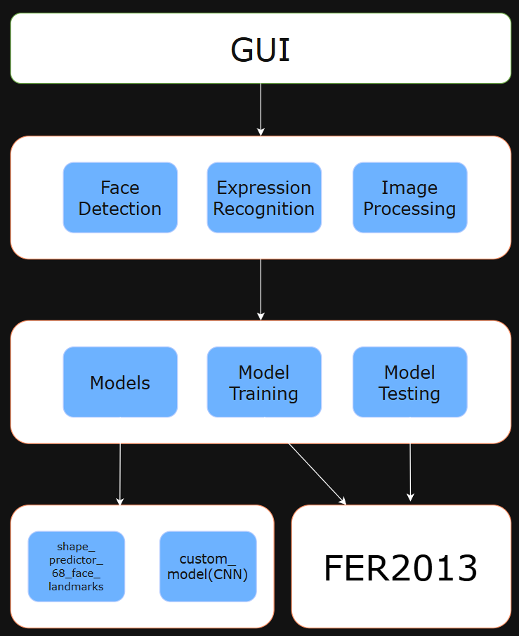

# ID-Photo-Generator：智能证件照生成系统
## 项目简介
本项目是数字图像处理课程的期末实践作品，旨在构建一款基于图像处理与人脸识别技术的自动证件照生成系统。系统通过集成图像预处理、人脸特征定位、表情识别与背景替换等关键模块，支持用户从任意照片一键生成符合规范、背景纯色的证件照。整个项目结合深度学习与经典图像处理技术，具有良好的实用性与扩展性。

核心亮点包括：

- 丰富的图像处理功能（空间域/频域/形态学等）

-  七类表情识别（基于CNN模型）

-  人脸自动定位（基于68点特征提取）

- 背景智能去除（支持白、红、蓝背景替换）

-  图形化界面交互（基于 PyQt5）

## 项目结构图


```
ID_Photo_Generator/
│
├── 前端模块 (UI)
│   └── PyQt5 界面交互
│
├── 核心功能模块 (Core)
│   ├── 人脸检测（face_detection）
│   │   └── 引入 dlib：68 点关键点检测
│   ├── 表情识别（expression_cnn）
│   │   └── PyTorch CNN 模型（7 类表情识别）
│   ├── 图像处理（image_processing）
│   │   └── 包括空间、频域、形态学、小波处理方法
│   ├── 背景替换（background_utils）
│   │   └── rembg 背景去除 + 白/红/蓝背景替换
│
├── 模型模块（Models）
│   ├── dlib shape_predictor 模型
│   └── CNN 权重文件
│
├── 训练 & 测试模块（Training & Evaluation）
│   ├── model_training：CNN 模型训练
│   └── test_expression：表情识别效果验证
│
├── 数据集（Dataset）
│   ├── train：FER2013 训练集样本
│   └── test：FER2013 测试集样本
│
└── 工程配置
    ├── main.py：程序入口（启动 GUI 并调度流程）
    ├── requirements.txt：依赖列表
    └── dlib 安装包：用于本地离线安装
```

## 技术实现详解
1. 人脸定位（68点标定）
借助 dlib 库中的预训练模型 shape_predictor_68_face_landmarks.dat 实现人脸特征点提取，精准识别面部轮廓、眼睛、嘴角等关键区域，为后续对齐、裁剪和表情分析提供可靠依据。

2. 表情识别模型（CNN）
- 使用 PyTorch 框架搭建了两个自定义 CNN 网络，基于 FER2013 数据集进行训练，表情分为七类：angry, disgust, fear, happy, neutral, sad, surprise
- 其中模型一准确率约为 66%，模型二为 64%，均在 happy 分类上表现最优。


CNN结构如下：
```python
class ImprovedEmotionCNN(nn.Module):
    def __init__(self, num_classes=7):
        super(ImprovedEmotionCNN, self).__init__()
        # 卷积网络结构
        self.features = nn.Sequential(
            nn.Conv2d(1, 64, kernel_size=3, padding=1),
            nn.BatchNorm2d(64),
            nn.LeakyReLU(0.1),
            nn.Conv2d(64, 64, kernel_size=3, padding=1),
            nn.BatchNorm2d(64),
            nn.LeakyReLU(0.1),
            nn.MaxPool2d(2, 2),
            nn.Dropout(0.25),
            
            nn.Conv2d(64, 128, kernel_size=3, padding=1),
            nn.BatchNorm2d(128),
            nn.LeakyReLU(0.1),
            nn.Conv2d(128, 128, kernel_size=3, padding=1),
            nn.BatchNorm2d(128),
            nn.LeakyReLU(0.1),
            nn.MaxPool2d(2, 2),
            nn.Dropout(0.25),
            
            nn.Conv2d(128, 256, kernel_size=3, padding=1),
            nn.BatchNorm2d(256),
            nn.LeakyReLU(0.1),
            nn.Conv2d(256, 256, kernel_size=3, padding=1),
            nn.BatchNorm2d(256),
            nn.LeakyReLU(0.1),
            nn.MaxPool2d(2, 2),
            nn.Dropout(0.25),
        )
        
        # 全连接层（用于分类）
        self.classifier = nn.Sequential(
            nn.Linear(256 * 6 * 6, 1024),
            nn.BatchNorm1d(1024),
            nn.LeakyReLU(0.1),
            nn.Dropout(0.5),
            
            nn.Linear(1024, 512),
            nn.BatchNorm1d(512),
            nn.LeakyReLU(0.1),
            nn.Dropout(0.5),
            
            nn.Linear(512, num_classes)
        )
        
    def forward(self, x):
        x = self.features(x)
        x = x.view(x.size(0), -1)
        x = self.classifier(x)
        return x
```
3. 背景替换
集成 rembg 模块实现图像背景自动去除，并支持用户选择 白色 / 红色 / 蓝色 背景替换，满足各类证件照的规范需求。

## 功能清单
### 基础图像处理部分：
- 打开图像
- 保存图像
- 旋转
- 平移（上下左右）
- 镜像（垂直、水平）
- 仿射变换
- 空域的平滑与锐化（直方图绘制/均衡化、灰度变换、平滑滤波、锐化滤波）
- 频域的平滑与锐化（低通滤波、高通滤波、带通滤波）
- 形态学操作（开运算、闭运算）
- 边缘检测
- 小波变换（小波去噪、小波边缘增强、小波压缩）

### 实际应用场景：
人脸检测与关键点提取
面部表情识别
证件照标准输出（背景色可选）

## 快速部署指南
- 环境要求:
- Python：3.8
- 推荐系统：Windows
- 安装依赖
- 在项目根目录执行：
```bash
pip install -r requirements.txt -i https://pypi.tuna.tsinghua.edu.cn/simple
pip install dlib-19.22.99-cp38-cp38-win_amd64.whl
```
- 运行程序:
`python main.py`
## 应用前景与扩展方向
该项目可进一步拓展至：
- 招聘简历照智能生成
- 电子政务人脸审核系统
- 表情识别应用（如课堂专注力分析）

如果你对图像处理、PyQt 界面设计或深度学习感兴趣，欢迎 fork 本项目，一起学习和优化！
