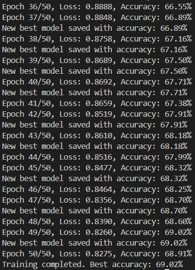
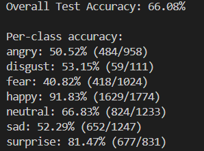
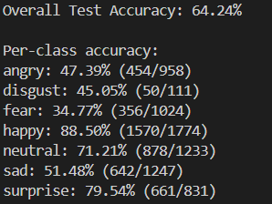

# 这是我的数字图像处理期末作业
## 项目简介
本项目旨在构建一个自动生成证件照的应用，用户上传照片后可对照片进行初步处理，例如：旋转、平移、镜像、仿射变换、空域的平滑与锐化（直方图绘制/均衡化、灰度变换、平滑滤波、锐化滤波）、频域的平滑与锐化（低通滤波、高通滤波、带通滤波）、形态学操作（开运算、闭运算）、边缘检测、小波变换（小波去噪、小波边缘增强、小波压缩）等功能，可以在处理后保存图片
之后对照片进行人脸检测与人脸表情识别，当检测到人脸且表情为中性/高兴时，允许生成证件照，用户可选择合适的背景颜色（白蓝红），同时支持保存生成的证件照

## 项目文件夹结构说明
- models文件夹下存放模型，有人脸68检测点模型和自定义模型1/2
- train和test文件夹为FER2013训练集/测试集
- ui文件夹存放主页面代码（基于PyQt）
- utils为工具类，包含基础图像处理代码，人脸识别核心代码，以及模型训练/测试代码，测试代码单独运行
- bg.jpg为界面背景图片
- dlib的whl安装包（python=3.8）
- README中图片标识为image-x.png
- main.py为项目运行入口
- requirements.txt描述项目依赖

## 项目相关
1. 使用了dlib库训练好的模型 “shape_predictor_68_face_landmarks.dat” 进行人脸68个特征点标定以定位人脸
2. 基于pytorch框架，利用FER2013数据集与自己设计的CNN，训练了人脸表情识别模型，可将人脸表情分为7类：'angry', 'disgust', 'fear', 'happy', 'neutral', 'sad', 'surprise'，模型一准确率在66%左右，模型二准确率在64%左右（happy表情识别率都非常高）

3. 使用了rembg库进行背景的去除以满足证件照纯色背景的要求

## 项目部署
- 项目在python==3.8上可运行（其他版本未测试）
- 首先在终端进入项目所在文件夹（命名为ID_Photo_Generator）
- 在命令行输入：
`pip install -r requirements.txt (-i https://pypi.tuna.tsinghua.edu.cn/simple)`
- 之后再输入：
`pip install dlib-19.22.99-cp38-cp38-win_amd64.whl`(文件夹中有该文件)
- 最后输入：
` python main.py `
即可运行项目

## 功能清单
### 基础图像处理部分：
- 旋转、
- 平移、
- 镜像、
- 仿射变换、
- 空域的平滑与锐化（直方图绘制/均衡化、灰度变换、平滑滤波、锐化滤波）、
- 频域的平滑与锐化（低通滤波、高通滤波、带通滤波）、
- 形态学操作（开运算、闭运算）、
- 边缘检测、
- 小波变换（小波去噪、小波边缘增强、小波压缩）

### 实际应用场景：
- 对人脸表情的识别（分为7类）
- 纯色背景证件照的生成（可更换背景颜色）